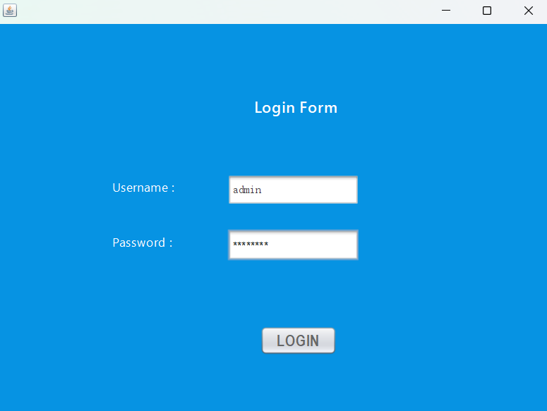
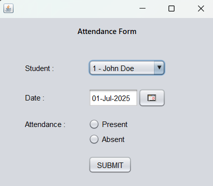

# Student-Management-System 💻
A Java Swing based Student Management System with Login, Signup, Attendance, and Performance modules.

This Student Management System is a desktop-based application for managing student records, attendance, and academic performance using Java.

## Features
- Login / Signup authentication (Secure login for admin and users)
- Dashboard navigation  
- Student management (Add, Edit, Delete, View)  
- Attendance tracking  
- Grade & Performance tracking 
- Clean and intuitive UI

## Technologies Used
- Java (Swing)  
- MySQL (Database)  
- JDBC (for Database connectivity)
- Netbeans (Java IDE)

## Libraries Required
- MySQL JDBC Connector
- JCalendar (for date inputs)
- Apache POI (for report export - optional)

## Installation

### Prerequisites
- JDK: 17.0.9
- NetBeans IDE: 19
- MySQL Server: 8.0.36
- MySQL Workbench: 8.0.36
- MySQL JDBC Connector: 8.0.33
- JCalendar: 1.4
- Apache POI: 5.2.3 (Optional)

## How to Run
1. Clone the repository
2. Open in NetBeans or any Java IDE
3. Import the `student_db.sql` file into your MySQL server:
   - If using phpMyAdmin: Go to the database → Import → Select `student_db.sql` → Click Go
   - If using terminal: Run  
     ```bash
     mysql -u root -p student_management < path/to/student_db.sql
     ```
4. Download and add the MySQL JDBC Driver- (Connector/J 8.0.33) to your project libraries 
5. Update your MySQL credentials in `DBConnection.java`:

   ```java
   conn = DriverManager.getConnection(
       "jdbc:mysql://localhost:3306/student_management",
       "root",      // your username
       "Your_Password"  // your password
   );

6. Connect your MySQL DB using `DBConnection.java`.     
7. Run `LoginForm.java` or `LandingPage.java` to start
   

## 📸 Screenshots

This section showcases important parts of the **Student Management System** built using Java Swing, NetBeans IDE, and MySQL. Below are the UI screens and project structure for a clear understanding of the application workflow.

---

### 🏠 Landing Page  
Initial welcome screen of the application.


---

### 🔐 Login Form  
Secure login interface for Admin and User roles.



---

### 📊 Dashboard  
Main dashboard panel with navigation to different modules.


---

### 🧑‍🎓 Student Registration Form  
Form to add, view, and manage student details.


---

### 📅 Attendance Management Form  
Interface to mark and track student attendance.



---

### 📈 Performance Entry Form  
Used for entering and managing academic performance or grades.


---

### 🗂️ Project Folder Structure in NetBeans  
Visual of how the project files and folders are structured inside NetBeans IDE.


---

 ## Future Improvements 
 - **Responsive Design**
 - **Web Integration**
 - **User Role-Based Access Control (RBAC)**  
 - **Export Options (PDF/Excel)**
 - **Cloud or Remote database support**

 ## Final Thoughts

This project was built as a desktop-based learning experience using Java Swing and MySQL. It helped me learn about GUI design, database integration, and project structure. While not perfect, it's a strong foundation for future upgrades and learning :)
